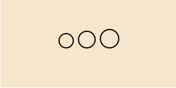

# personBlogH5
# 目录结构
### static-----------------------------静态文件

### view-------------------------------页面 

* ajax-----------------------------ajax请求练习
* animationPage--------------------动画练习
* bootsrap-------------------------响应式练习
* canvas---------------------------canvas基本api学习
* fullPage--------------------------整页上滑动效练习
* jquery----------------------------jquery api练习
* less------------------------------less 语法练习
* loading---------------------------animation练习❀一个loading
* mbyq------------------------------模板引擎练习
* sass------------------------------sass语法练习
* svg-------------------------------svg语法练习
* vue-------------------------------vue非脚手架练习

# 特殊案例
### animationPage-album.html

* 关于相册的翻页动效，目前只能在网页的f12，手机调试页面看，有待完善
* 

### loading--bubble

* 用css3的animation做的一个小泡泡loading
* 

